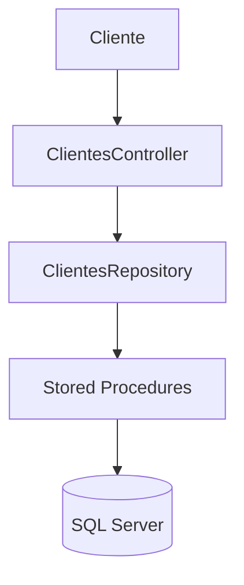

````md
<div align="center">

# 🚀 Cadastro de Clientes API

API REST desenvolvida em **ASP.NET Core 8** para gerenciamento de clientes utilizando **SQL Server**, **ADO.NET** e **Stored Procedures**.


</div>

---

# 📖 Sobre o Projeto

O **Cadastro de Clientes API** é uma aplicação desenvolvida em **ASP.NET Core 8** com foco na implementação de um **CRUD completo** de clientes.

A aplicação utiliza o padrão **Repository**, acesso ao banco por meio do **ADO.NET** e execução das operações através de **Stored Procedures**, proporcionando uma arquitetura simples, organizada e de fácil manutenção.

---

# ✨ Funcionalidades

- ✅ Cadastrar clientes
- ✅ Atualizar clientes
- ✅ Consultar cliente por ID
- ✅ Listar todos os clientes
- ✅ Excluir clientes
- ✅ Documentação automática via Swagger

---

# 🛠 Tecnologias Utilizadas

| Tecnologia | Descrição |
|------------|-----------|
| C# | Linguagem de programação |
| ASP.NET Core 8 | Framework para APIs REST |
| .NET 8 | Plataforma de desenvolvimento |
| SQL Server | Banco de dados relacional |
| ADO.NET | Acesso ao banco de dados |
| Stored Procedures | Manipulação dos dados |
| Swagger | Documentação e testes da API |
| Visual Studio 2022 | Ambiente de desenvolvimento |

---

# 🏛 Arquitetura



---

# 📂 Estrutura do Projeto

```text
CadastroClientes
│
├── BancoDados
│   ├── Scripts SQL
│   └── Stored Procedures
│
├── Controllers
│   └── ClientesController.cs
│
├── Models
│   ├── Clientes.cs
│   └── Repository
│       ├── AppConnection.cs
│       └── ClientesRepository.cs
│
├── Program.cs
├── appsettings.json
├── CadastroClientes.csproj
└── README.md
```

---

# 🗄 Banco de Dados

Na pasta **BancoDados** encontram-se todos os scripts necessários para criação da estrutura do banco.

Execute os scripts na seguinte ordem:

1. Tabela de Clientes
2. Procedure de Inserção
3. Procedure de Atualização
4. Procedure de Exclusão
5. Procedure de Consulta
6. Procedure de Listagem

---

# 🚀 Como Executar

## 1. Clonar o repositório

```bash
git clone https://github.com/LuizCarlossr/CadastroClientes.git
```

---

## 2. Abrir a solução

Abra o arquivo

```
CadastroClientes.sln
```

utilizando o **Visual Studio 2022 Community**.

---

## 3. Configurar o banco

Execute os scripts SQL localizados na pasta:

```
BancoDados/
```

---

## 4. Configurar a Connection String

Edite o arquivo:

```json
appsettings.json
```

Exemplo:

```json
{
  "ConnectionString": {
    "ConnString": "Server=SEU_SERVIDOR;Database=Corporativo;User Id=USUARIO;Password=SENHA;Encrypt=False;"
  }
}
```

---

## 5. Executar a aplicação

No Visual Studio:

```
F5
```

ou

```
Ctrl + F5
```

---

# 🌐 Documentação da API

Após iniciar a aplicação, o Swagger estará disponível em:

```
https://localhost:5001/swagger
```

*A porta poderá variar conforme a configuração do projeto.*

---

# 📌 Endpoints

| Método | Endpoint | Descrição |
|---------|----------|-----------|
| GET | `/api/Clientes/Listar` | Lista todos os clientes |
| GET | `/api/Clientes/GetCliente?idCliente={id}` | Consulta um cliente |
| POST | `/api/Clientes/Salvar` | Cadastra um cliente |
| PUT | `/api/Clientes/Alterar` | Atualiza um cliente |
| DELETE | `/api/Clientes/Deletar?idCliente={id}` | Exclui um cliente |

---

# 📥 Exemplo de Requisição

### POST - Cadastrar Cliente

```json
{
  "documento": "12345678900",
  "nome": "Luiz Carlos S R",
  "sexo": "M",
  "email": "luizcarlossr@email.com",
  "telefone": "(11)99999-9999",
  "fax": "(11)99999-9999",
  "uf": "SP"
}
```

---

# 📤 Exemplo de Resposta

```json
{
  "idCliente": 1,
  "documento": "12345678900",
  "nome": "Luiz Carlos S R",
  "sexo": "M",
  "email": "luizcarlossr@email.com",
  "telefone": "(11)99999-9999",
  "fax": "(11)99999-9999",
  "uf": "SP"
}
```

---

# 📷 Capturas de Tela

## Swagger

> Adicione a imagem em:

```
docs/images/swagger.png
```

```md

```

---

## Banco de Dados

> Adicione a imagem em:

```
docs/images/sqlserver.png
```

```md

```

---

## Stored Procedures

> Adicione a imagem em:

```
docs/images/procedures.png
```

```md

```

---

# 🚀 Melhorias Futuras

- 🔐 Autenticação JWT
- ✅ Validação de dados
- 📄 Paginação
- 🔍 Filtros de pesquisa
- 📊 Logs com Serilog
- 🧪 Testes unitários
- 🐳 Docker
- ☁ Deploy em Azure

---

# 📄 Licença

Este projeto foi desenvolvido para fins de estudo e aprendizado.

Sinta-se à vontade para utilizá-lo como referência em seus estudos.

---

<div align="center">

### ⭐ Se este projeto foi útil para você, deixe uma estrela no repositório!

Desenvolvido com ❤️ utilizando **C#**, **ASP.NET Core** e **SQL Server**.

</div>
````
