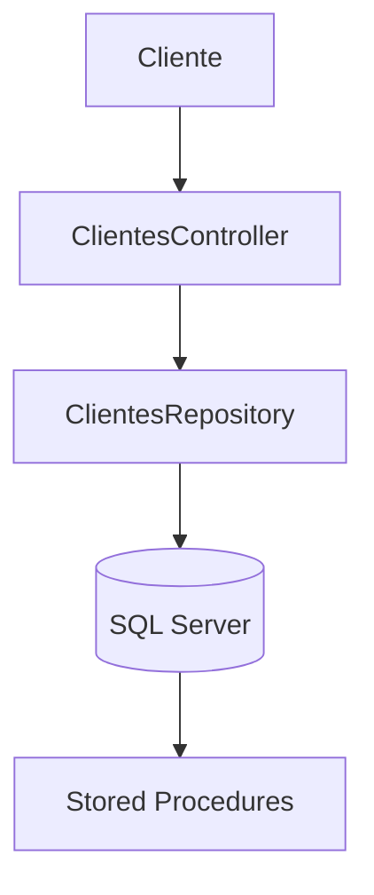

<div align="center">

# 🚀 Cadastro de Clientes API

### API REST desenvolvida em ASP.NET Core 8 para gerenciamento de clientes

[](https://dotnet.microsoft.com/)
[](https://learn.microsoft.com/dotnet/csharp/)
[](https://learn.microsoft.com/aspnet/core)
[](https://www.microsoft.com/sql-server)
[](https://swagger.io/)

Projeto desenvolvido para demonstrar um **CRUD completo** utilizando **ASP.NET Core 8**, **SQL Server** e **Stored Procedures**.

</div>

---

# 📑 Índice

- [📖 Sobre o Projeto](#-sobre-o-projeto)
- [✨ Funcionalidades](#-funcionalidades)
- [🛠 Tecnologias Utilizadas](#-tecnologias-utilizadas)
- [🏛 Arquitetura](#-arquitetura)
- [📂 Estrutura do Projeto](#-estrutura-do-projeto)
- [🚀 Como Executar](#-como-executar)
- [🗄 Banco de Dados](#-banco-de-dados)
- [🌐 Documentação da API](#-documentação-da-api)
- [📌 Endpoints](#-endpoints)
- [📥 Exemplo de Requisição](#-exemplo-de-requisição)
- [🎯 Objetivos](#-objetivos)
- [🚀 Melhorias Futuras](#-melhorias-futuras)
- [🤝 Contribuição](#-contribuição)
- [👨‍💻 Autor](#-autor)
- [📄 Licença](#-licença)

---

# 📖 Sobre o Projeto

O **Cadastro de Clientes API** é uma API REST desenvolvida em **ASP.NET Core 8** com o objetivo de gerenciar o cadastro de clientes de forma simples, organizada e eficiente.

O projeto implementa um **CRUD completo**, permitindo:

- Cadastro de clientes;
- Consulta por ID;
- Listagem de todos os clientes;
- Atualização de registros;
- Exclusão de clientes.

A persistência dos dados é realizada em **SQL Server** através de **Stored Procedures**, enquanto a documentação da API é disponibilizada automaticamente utilizando **Swagger (OpenAPI)**.

Este projeto foi desenvolvido para fins de estudo, prática e demonstração de conhecimentos em desenvolvimento de APIs utilizando a plataforma .NET.

---

# ✨ Funcionalidades

- ✅ Cadastro de Clientes
- ✅ Consulta de Clientes por ID
- ✅ Listagem de Clientes
- ✅ Atualização de Clientes
- ✅ Exclusão de Clientes
- ✅ Integração com SQL Server
- ✅ Utilização de Stored Procedures
- ✅ Documentação automática via Swagger

---

# 🛠 Tecnologias Utilizadas

| Tecnologia | Descrição |
|------------|-----------|
| C# | Linguagem de programação |
| ASP.NET Core 8 | Framework para APIs REST |
| .NET 8 | Plataforma de desenvolvimento |
| SQL Server | Banco de dados relacional |
| Microsoft.Data.SqlClient | Biblioteca para conexão com SQL Server |
| Swagger (OpenAPI) | Documentação e testes da API |
| Visual Studio 2022 Community | Ambiente de desenvolvimento |
| Git | Controle de versão |
| GitHub | Hospedagem do projeto |
```

````md
---

# 🏛 Arquitetura

A API foi desenvolvida utilizando uma arquitetura simples e organizada, separando as responsabilidades entre as camadas de **Controller**, **Model** e **Acesso aos Dados**, facilitando a manutenção e evolução do projeto.



---

# 📂 Estrutura do Projeto

```text
CadastroClientes
│
├── BancoDados
│   ├── Scripts SQL
│   └── Stored Procedures
│
├── Controllers
│   └── ClientesController.cs
│
├── Models
│   ├── Clientes.cs
│   └── Repository
│       ├── AppConnection.cs
│       └── ClientesRepository.cs
│
├── Properties
│
├── Program.cs
├── appsettings.json
├── CadastroClientes.csproj
└── README.md
```

---

# 🗄 Banco de Dados

O projeto utiliza o **Microsoft SQL Server** para armazenamento das informações dos clientes.

Na pasta **BancoDados** encontram-se todos os scripts necessários para criação da estrutura do banco de dados e das Stored Procedures.

### Ordem recomendada para execução dos scripts

1. Criar a tabela **Clientes**;
2. Criar a Stored Procedure para Inserção;
3. Criar a Stored Procedure para Atualização;
4. Criar a Stored Procedure para Exclusão;
5. Criar a Stored Procedure para Consulta por ID;
6. Criar a Stored Procedure para Listagem de Clientes.

Após executar esses scripts, o banco estará pronto para utilização pela API.

---

# 🚀 Como Executar o Projeto

## 1️⃣ Clonar o Repositório

```bash
git clone https://github.com/LuizCarlossr/CadastroClientes.git
```

---

## 2️⃣ Abrir a Solução

Abra o arquivo:

```text
CadastroClientes.sln
```

utilizando o **Visual Studio 2022 Community**.

---

## 3️⃣ Configurar o Banco de Dados

Execute todos os scripts localizados na pasta:

```text
BancoDados
```

utilizando o **SQL Server Management Studio (SSMS)**.

---

## 4️⃣ Configurar a Connection String

Abra o arquivo:

```text
appsettings.json
```

Exemplo:

```json
{
  "ConnectionString": {
    "ConnString": "Server=SEU_SERVIDOR;Database=Corporativo;User Id=USUARIO;Password=SENHA;Encrypt=False;"
  }
}
```

Substitua os valores acima pelas informações do seu ambiente.

> **Importante:** Não publique credenciais reais no GitHub.

---

## 5️⃣ Executar a Aplicação

No Visual Studio:

- Pressione **F5** para iniciar com depuração.
- Ou pressione **Ctrl + F5** para executar sem depuração.

Após a inicialização, a API estará pronta para receber requisições.

---

# 🌐 Documentação da API

Com a aplicação em execução, acesse a documentação gerada automaticamente pelo Swagger:

```text
https://localhost:5001/swagger
```

ou

```text
http://localhost:5000/swagger
```

> **Observação:** A porta pode variar de acordo com a configuração do Visual Studio ou do arquivo `launchSettings.json`.

O Swagger permite:

- Visualizar todos os endpoints disponíveis;
- Testar requisições diretamente pelo navegador;
- Consultar parâmetros e modelos de dados;
- Verificar os retornos da API.
````

````md
---

# 📌 Endpoints da API

A API disponibiliza os seguintes endpoints para gerenciamento de clientes:

| Método | Endpoint | Descrição |
|:-------:|----------|-----------|
| GET | `/api/Clientes/Listar` | Lista todos os clientes |
| GET | `/api/Clientes/GetCliente?idCliente={id}` | Consulta um cliente pelo ID |
| POST | `/api/Clientes/Salvar` | Cadastra um novo cliente |
| PUT | `/api/Clientes/Alterar` | Atualiza um cliente existente |
| DELETE | `/api/Clientes/Deletar?idCliente={id}` | Remove um cliente |

---

# 📥 Exemplo de Requisição

### Cadastrar Cliente

**POST** `/api/Clientes/Salvar`

```json
{
  "documento": "12345678900",
  "nome": "Luiz Carlos S R",
  "sexo": "M",
  "email": "luiz@email.com",
  "telefone": "(11)99999-9999",
  "fax": "(11)99999-9999",
  "uf": "SP"
}
```

---

### Atualizar Cliente

**PUT** `/api/Clientes/Alterar`

```json
{
  "idCliente": 1,
  "documento": "12345678900",
  "nome": "Luiz Carlos S R",
  "sexo": "M",
  "email": "novoemail@email.com",
  "telefone": "(11)99999-9999",
  "fax": "(11)99999-9999",
  "uf": "SP"
}
```

---

### Consultar Cliente

**GET**

```http
/api/Clientes/GetCliente?idCliente=1
```

---

### Listar Clientes

**GET**

```http
/api/Clientes/Listar
```

---

### Excluir Cliente

**DELETE**

```http
/api/Clientes/Deletar?idCliente=1
```

---

# 📤 Exemplo de Resposta

```json
{
  "idCliente": 1,
  "documento": "12345678900",
  "nome": "Luiz Carlos S R",
  "sexo": "M",
  "email": "luiz@email.com",
  "telefone": "(11)99999-9999",
  "fax": "(11)99999-9999",
  "uf": "SP"
}
```

---

# 📡 Códigos de Resposta HTTP

| Código | Descrição |
|:------:|-----------|
| **200** | Requisição realizada com sucesso |
| **201** | Registro criado com sucesso |
| **400** | Requisição inválida |
| **404** | Registro não encontrado |
| **500** | Erro interno do servidor |

---

# 🎯 Objetivos do Projeto

Este projeto foi desenvolvido com o objetivo de praticar e demonstrar conhecimentos em:

- Desenvolvimento de APIs REST com ASP.NET Core;
- Integração com SQL Server;
- Utilização de Stored Procedures;
- Organização de projetos em camadas;
- Documentação automática utilizando Swagger;
- Versionamento de código com Git e GitHub.

---

# 🚀 Melhorias Futuras

Algumas melhorias que podem ser implementadas futuramente:

- 🔐 Autenticação utilizando JWT;
- 👤 Controle de usuários e perfis;
- ✅ Validação de dados com FluentValidation;
- 📄 Paginação de registros;
- 🔍 Pesquisa com filtros;
- 📊 Logs utilizando Serilog;
- 🧪 Testes unitários com xUnit;
- 🐳 Docker;
- ☁️ Deploy no Microsoft Azure.

````
